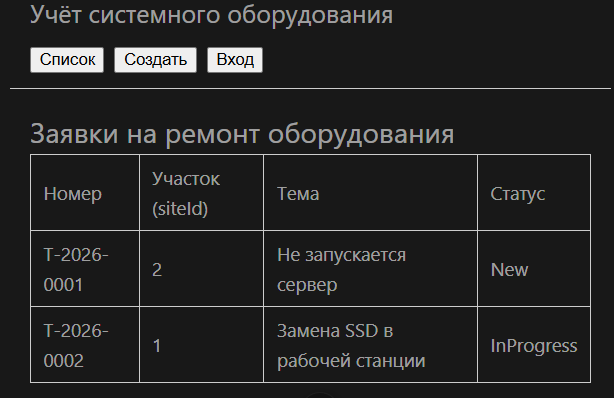
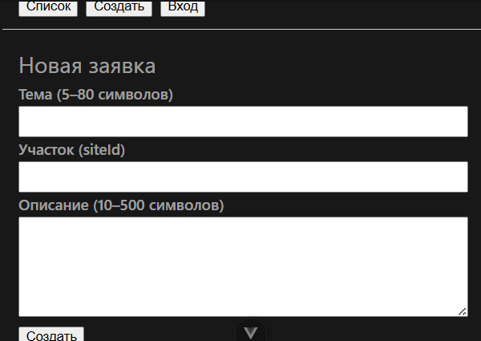
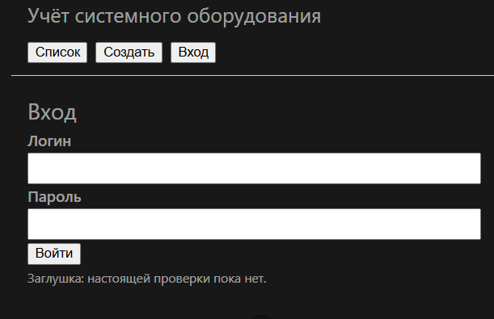

## Чеклист семантики

| № | Проверка | да/нет |
|---|---|---|
| 1 | Есть `<main>` на рабочих экранах | да |
| 2 | Форма создания обёрнута в `<form>` | да |
| 3 | У каждого поля есть `<label>` через `for`/`id` | да |
| 4 | Список — `<table>`, не безликие `div` | да |
| 5 | При открытии формы фокус на теме (`autofocus`) | да |
| 6 | Стили в `scoped`, макет читаемый | да |
| 7 | Поля и статусы читаются | да |

### Экран «Список»

### Экран «Создать»

### Экран «Вход»

## Соответствие ЛР1

Критерий 1 ЛР1 закрывают поля `title`, `siteId`, `description`.