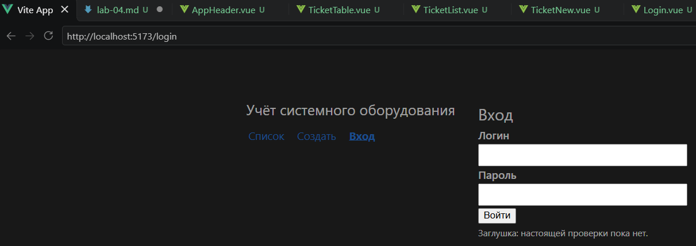
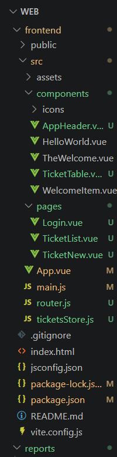

## Что сделано

- Подключён `vue-router`, три маршрута: `/`, `/new`, `/login`.
- Шапка вынесена в `AppHeader.vue` и стоит снаружи `router-view`.
- Таблица вынесена в `TicketTable.vue` и получает `items` через props.
- Массив заявок перенесён в `src/ticketsStore.js` — единственный источник.

## Схема App.vue

App.vue
├── AppHeader ← всегда виден
└── router-view ← текущая страница

## Скриншоты

## Данные

Таблица получает массив через props, источник — `ticketsStore.js`.